# IUDX_Assignment

## Assignment-1:
```
Write a application/use your existing/easy to do projects from internet with following criteria:
a. A basic HTTP web application in any language which takes some input through an API endpoint and process it and 
store the data to db
b. The database can be mysql, psql, mongodb etc. 
```
### Solution
http://127.0.0.1:5000/ web application takes input through http://127.0.0.1:5000/weather/{Latitude}/{Longitude} 
API ENDPOINT and processing the coordinates using openweathermap and storing the location and current weather to MYSQL database. 

#### steps:
  - https://github.com/Buddhadev25/IUDX_Assignment/blob/master/Assignment-1/main.py Flask API server developed, where http://127.0.0.1:5000/(route root) rendering Weather.html file. 
  - When ENDPOINT sends Latitude, Longitude as input, weather function is taking these inputs and start processing 
  through https://openweathermap.org/api and calculate current weather and location. 
  - Then current weather and location details are passed to store function, this function will store these 
  information in MYSQL database. 
  - Created MYSQl database in my local server named webapi and table named weather

Screenshots are attached. 

<p align="center">
  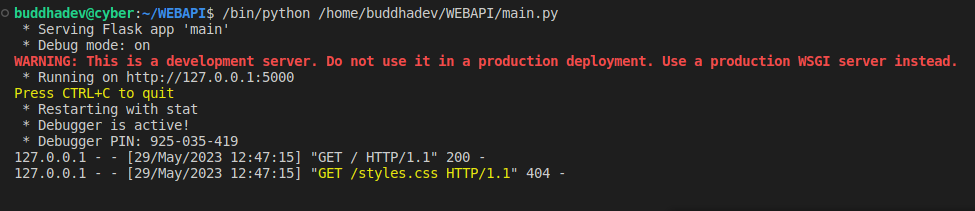
  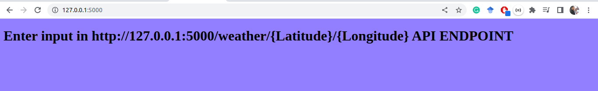
  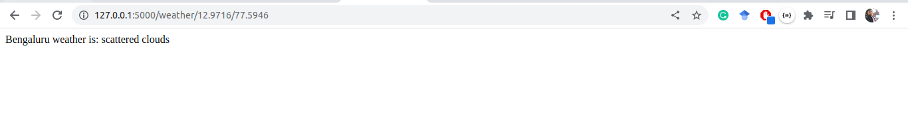
  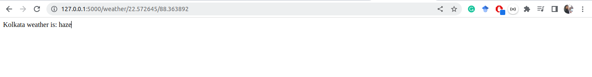
  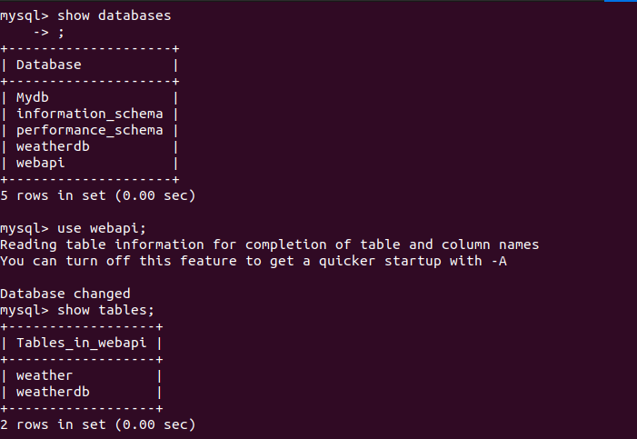
  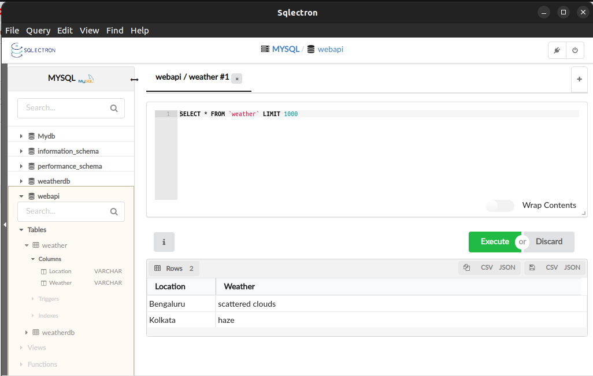
</p>

## Assignment-2:
```
Containerise and deploy the two components in local machine using docker-compose
a) Refer docker docs and docker-compose docs
b) Expose the web application in docker to outside world, so that it can be accessed through something like http://localhost:35622/xyz/
```
### Solution
Here I am containerizing Postgres and todo-list components using docker-compose. The aim is to add New Item in 
the todo-list web interface and store the item in Postgres database. 

#### Steps:

- Followed https://docs.docker.com/engine/install/ubuntu/ docs for Install Docker Engine
- Developed Assignment-2/docker-compose.yaml and postgres-connection.json file
- I am using postgres 11.5 docker image, and exposing 5433 port, and using volume /data/postgress for data persistance purpose. 
- todo-list container exposed on 8050 port, and connecting the database using environment variables and 
postgres secrets file /app/config/secrets.json
- **Sending postgres database secrets as a file named postgress-connection.json, this can help to manage 
any sensitive data and when we dont wants to store credentials in version control systems like Gitlab or Github.**
- Used docker compose up command to run multi-container Docker application.

Screenshots are attached. 

<p align="center">
  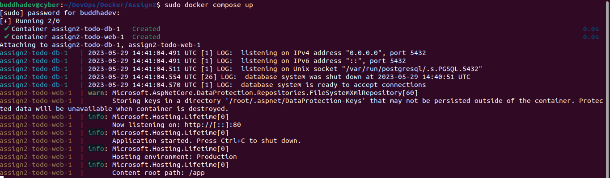
  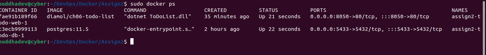
  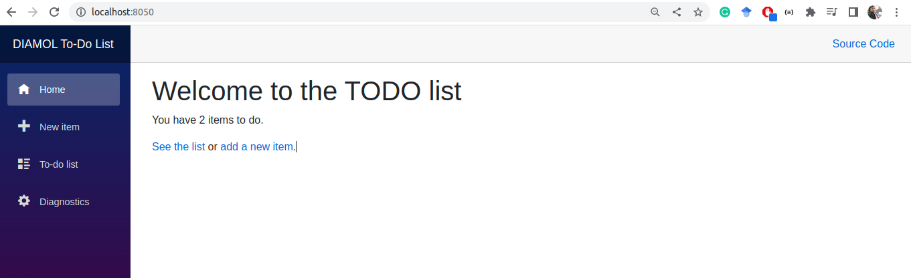
  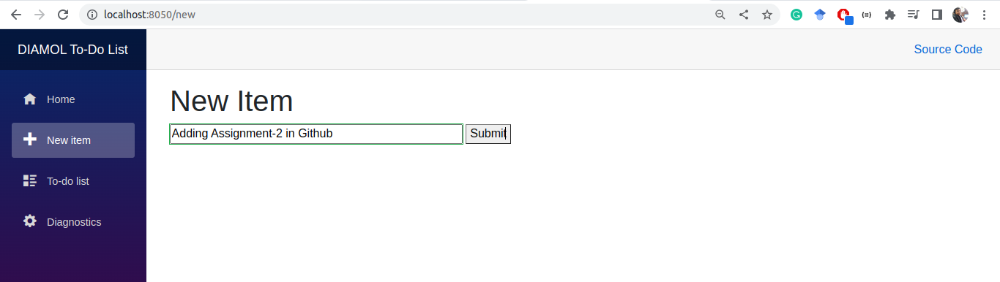
  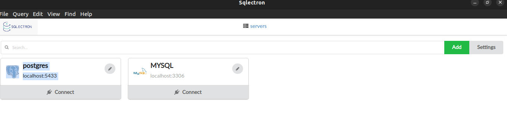
  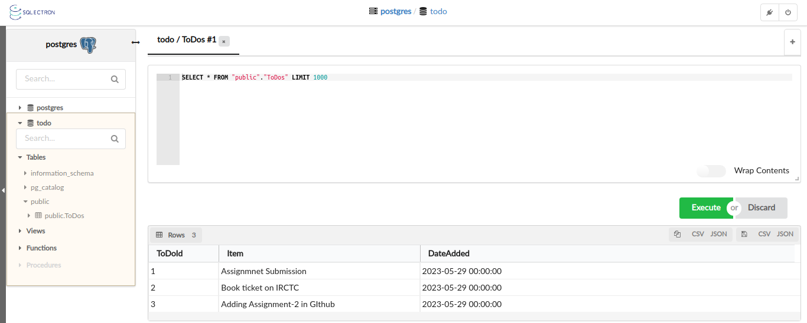
  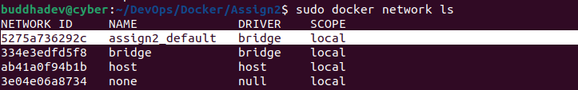
  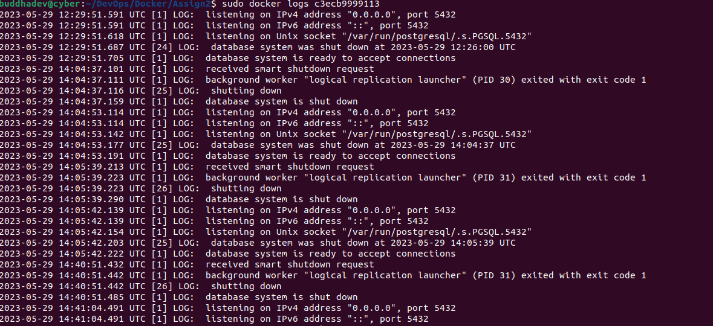
</p>

## Assignment-3:
```
Containerise and deploy the two components in local K8s minikube cluster (using kubectl only):
a) Please see the instructions on how to create a minikube on a local machine at
https://github.com/datakaveri/iudx-deployment/tree/master/K8s-deployment/K8s-cluster/minikube .
b) Add auto scaling to any one of the components - web server or database.
c) Expose the web application in K8s to outside world, so that it can be
accessed through something like http://localhost:35622/xyz/
```
### Solution
I am containerizing and deploying mongo database and mongo-express web admin interfaces in local K8s minikube cluster. Adding data in mongo-express and the data is stored in mongo database. 

#### Steps:

- Followed https://minikube.sigs.k8s.io/docs/start/ docs for local Kubernetes cluster(minikube) installation
- **mongo-secret.yaml file contains the environments of mongo db. username and password are in base64. 
When we don't want to store credentials in version control systems we use Kubernetes secrets file.**
- mongo.yaml is type deployment and mongo db username, and password is referenced from mongodb-secret. 
Also, an internal service is created so that other pods can communicate with mongo db pod. 
- mongo-configmap.yaml contain mongo db server details, mongodb-service is the service of mongo db.
- Mongo express is a frontend app that will access the mongo DB. To access DB, I configured DB url in pod template. 
mongo username and password is referenced from the same mongodb-secret. 
The value of ME_CONFIG_MONGODB_SERVER is referenced from mongodb-configmap. 
The type of this service is LoadBalancer and LoadBalancer accepts external requests by assigning 
the service with an external IP address. 30000 Nodeport is exposed, so that we can access the service from the browser.  
- Implemented Horizontal Pod Autoscaler(HPA) for adjusts the number of replicas of mongo-express application. Here HPA maintains between 2 and 10 replicas of the pods controled by HPA. Target of 50% is the average CPU utilization that HPA needs to maintain alltime. 

Screenshots are attached. 

<p align="center">
  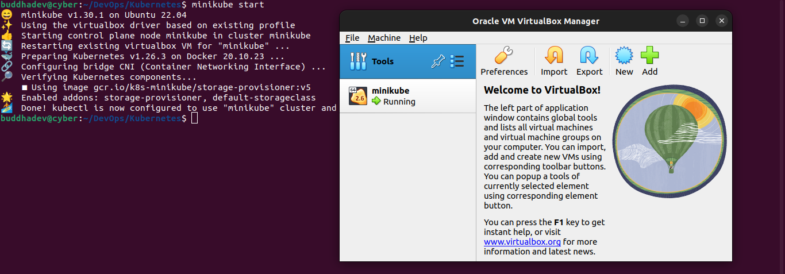
  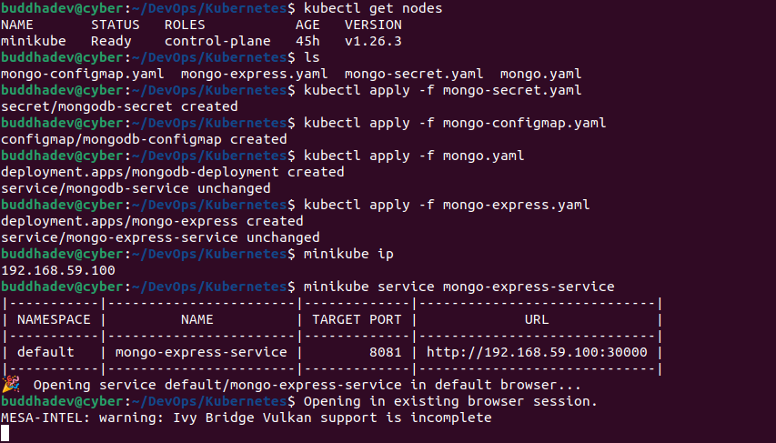
  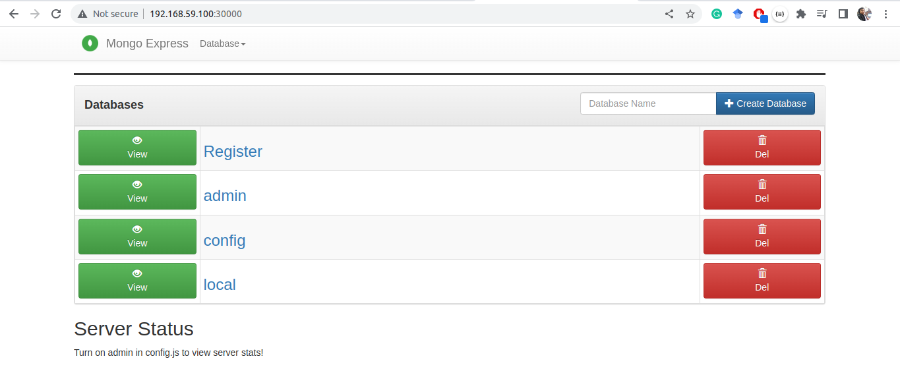
  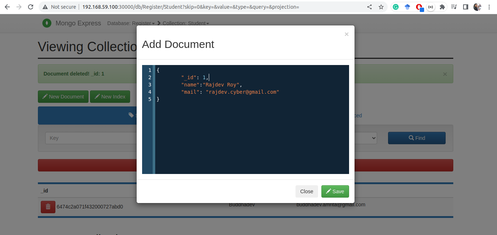
  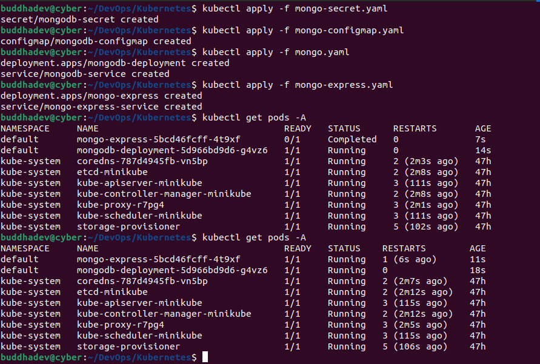
  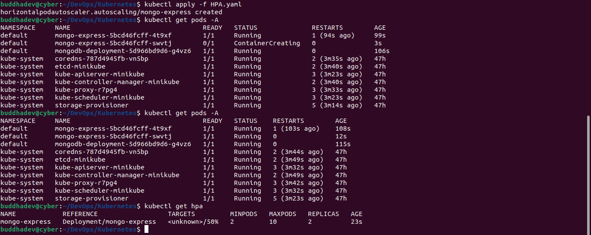
</p>

> Since Metrics Server is not installed on cluster, current CPU utilization is unknown by kubernetes. 
